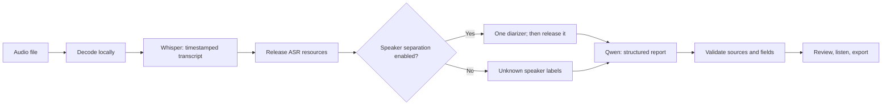

# Megan — implementation plan

Updated 2026-09-11 after reviewing the case and initial plan. See [ANALYSIS.md](ANALYSIS.md) for the requirement analysis, technical findings, and decision rationale.

**Status: core implementation locally validated; RTX acceptance pending.** The two-model app, PostgreSQL persistence, review UI, exports, and tests are implemented. See [README.md](../README.md) for launch instructions and [VERIFICATION.md](VERIFICATION.md) for measured results and remaining target-machine checks. Optional tiers below remain design options, not claims of implemented features.

## 1. Outcome and constraints

Deliver a local app accepting MP3, WAV, and M4A recordings and producing:

- An executive summary of 3–5 supported sentences.
- Decisions, topics with theses, and unresolved questions.
- Tasks with owner, task text, deadline if stated, and priority.
- A downloadable complete JSON report.
- Timestamped sources that a reviewer can inspect and play.

The [brief](TZ_AI_Meeting_Intelligence.pdf) assigns 70 points to mandatory functionality, accuracy, and locality; 15 to bonus features; 10 to UI/performance; and 5 to presentation. The [deck](AI_Steppe_Tech_Hack_Tasks.pptx) gives eight development hours and unfamiliar jury audio. Two-minute processing speed is scored, but no numerical cutoff is supplied.

**Team:** two developers. **Demo target:** Fatikh's RTX 4060 machine. **Development/test machine:** user's Apple M5 Mac, with 16 GB unified memory confirmed locally. The previous Linux, 8 GB VRAM, and 15 GB system-RAM figures must be checked on Fatikh's machine.

**Database decision:** PostgreSQL, as requested by the user. It replaces SQLite entirely. Each machine runs its own local instance with the same versioned schema; no shared online database is required.

**Product promise:** reviewable meeting outcomes processed on the device. A source link allows inspection; it does not guarantee correct recognition or interpretation.

## 2. How many models, and how they run

| Stage | Model | Required? | Execution |
|---|---|---|---|
| Transcribe | One multilingual Whisper checkpoint; initially large-v3-turbo if target tests pass | Yes | After decoding |
| Separate speakers | One diarizer: Community-1 or a preserved, working Sortformer | Bonus | After releasing ASR resources |
| Produce report | One Qwen through local Ollama; evaluate `qwen3.5:4b` first | Yes | After releasing audio-model resources |
| Answer questions | Reuse the same Qwen | Bonus | On demand, through the same scheduler |
| Dense retrieval | Optional multilingual-e5-small on CPU | Deferred | Only if keyword retrieval is inadequate |

**Two models cover the mandatory flow. Three include speaker separation.** Summary, decisions, tasks, and chat reuse the same LLM. Date resolution uses ordinary code. ffmpeg is an audio tool, not an AI model.



Sequential stages reduce simultaneous model memory. They do not establish peak usage: measure weights, context/cache, runtime buffers, display use, and system RAM. Ollama lists the current [4B artifact at 3.4 GB](https://ollama.com/library/qwen3.5:4b) and [9B at 6.6 GB](https://ollama.com/library/qwen3.5:9b); neither is a runtime-memory guarantee. Promote 9B only after a measured extraction improvement justifies its memory and latency.

Do not download multiple diarizers or a specialized Kazakh checkpoint as prerequisites. The latter is a separate experiment after the baseline works.

## 3. Running on both machines

| Component | RTX 4060 demo profile | M5 Mac profile |
|---|---|---|
| Frontend | Built React SPA served locally | Same SPA; Vite during development |
| API/data | FastAPI, Pydantic, local PostgreSQL, local job files | Same code, schema, and a separate local PostgreSQL instance |
| ASR runtime | faster-whisper / CTranslate2 on CUDA | whisper.cpp using Metal |
| LLM | Local Ollama and selected Qwen | Local Ollama; same checkpoint if memory permits |
| Diarization | One backend after MVP | Optional; test disabled path first, CPU if practical |
| Acceptance | Determines demo readiness and timing | Checks portability; does not replace target benchmarks |

The ASR split follows [CTranslate2's hardware support](https://opennmt.net/CTranslate2/hardware_support.html) and [whisper.cpp's Apple Silicon support](https://github.com/ggml-org/whisper.cpp). Implement a small adapter returning the same segment contract. Weight formats differ by runtime, and text/timestamps may differ too; bit-for-bit parity is not required.

Develop the Mac UI/API against clearly labeled fixtures first. Then smoke-test the complete audio workflow with Metal ASR and Ollama. If memory requires a smaller Mac checkpoint, label the profile and retain target-machine evaluation. Shared frontend code alone does not prove Mac inference works.

Configuration: `ASR_BACKEND`, `ASR_MODEL_PATH`, `OLLAMA_MODEL`, `OLLAMA_BASE_URL`, `DIARIZATION_BACKEND`, `DATA_DIR`, `DATABASE_URL`. Bind the demo to loopback and use local connections for Ollama and PostgreSQL. Keep database credentials out of Git. Do not hard-code either developer's home directory or require a remote inference server.

**Handoff to Fatikh:** push application code, dependency locks, database migrations, and setup/run instructions. Fatikh pulls the repository, installs dependencies, downloads the two model artifacts locally, starts PostgreSQL and Ollama, and tests the complete flow on his RTX laptop. Model weights, recordings, database files, and secrets stay out of Git. His existing model files must be checked before reusing them; their presence and compatibility are not yet verified. The Mac can run its own local models for development, but it is not required to serve inference to Fatikh's demo.

## 4. Scope and cut order

| Tier | Work | Gate |
|---|---|---|
| P0 | Audio formats; transcript; all mandatory report sections; unknown fields; JSON; local inference; failure states | Complete before optional model stages |
| P1 | Source playback; progress; owner/date checks; CSV; correction tracking if time permits | Real upload → report works |
| P2 | One diarizer; explicitly stated risks/blockers; local ICS export | P0 passes unfamiliar audio and leaves testing time |
| P3 | Cited RAG; specialized Kazakh rerouting; PDF; dense retrieval; long-meeting reconciliation | Measured benefit and time remain |

Multilingual Whisper is the baseline; evaluate RU/KZ/EN and mixed speech early. Specialized rerouting is the stretch feature. Prefer one or two useful bonuses to partially implementing every bonus.

Cut order: dense embeddings → second ASR/routing → PDF → RAG → ICS → advanced editing/naming → diarization. Preserve mandatory sections, JSON, and correctness checks. Keep source playback unless it prevents completing basic audio processing.

A local PostgreSQL server is part of the runtime. No model training, distributed queue, authentication system, or live tracker API is needed. The brief explicitly accepts local `.ics` generation for the integration bonus.

## 5. Architecture and ownership

```text
Browser → FastAPI → local PostgreSQL (jobs, report revisions, edits)
              │
              └→ one job runner → local audio subprocess → Ollama on loopback
                           └→ stage progress and saved artifacts

data/jobs/<generated_job_id>/
  original.<detected_format>
  normalized.wav
  transcript.json
  report.json
```

PostgreSQL is the authoritative store for job state, report revisions, and edits; report payloads can use JSONB. Audio and transcript artifacts stay in local files, while `report.json` is generated from the stored report revision. Keep a small application connection pool and short transactions; never hold a database transaction open during model inference. Commit a report revision and its completed job status together. PostgreSQL runs as a separate local server, following its [client/server architecture](https://www.postgresql.org/docs/current/tutorial-arch.html).

**Dev A / teammate:** target setup, ASR, optional diarization, extraction, semantic checks, model lifecycle, CLI, measurements.

**Dev B / user:** API/persistence, orchestration, frontend, playback, exports, packaging, Mac adapter once the shared flow is integrated. Both own contract agreement and manual output evaluation.

Use one API process and one active inference job for the demo. Reject another upload with a useful busy response rather than an unlimited implicit queue. If chat ships, route it through the same scheduler so Qwen cannot reload during an audio stage. UI, report reads, and playback remain responsive.

Synchronous model work must execute outside the API event loop. A managed subprocess per audio stage provides a clear resource and failure boundary; await its exit before the next model. Retain processes only if measurements justify lifecycle complexity. Close ASR iterators and model references: a PyTorch cache call is not a universal unload mechanism. See [CTranslate2's memory guide](https://opennmt.net/CTranslate2/memory.html).

Use Ollama's supported unload mechanism before any subsequent GPU audio stage and verify completion. Its [FAQ](https://docs.ollama.com/faq) documents model lifetime controls. Test consecutive jobs and chat → job transitions for retained memory.

Persist stages and errors. On restart, mark unfinished work `interrupted` and expose retry. Save the transcript before extraction so an LLM retry does not require repeating ASR.

Suggested layout; optional modules are created only when their gate is reached:

```text
backend/
  main.py, schemas.py, db.py, worker.py, cli.py
  migrations/              # versioned PostgreSQL schema changes
  pipeline/
    audio.py, asr.py, structure.py, validate.py, dates.py, export.py
    diarize.py, align.py    # bonus
    rag.py                 # stretch
frontend/src/
scripts/
  preflight.py, setup_models.*, run_local.*, benchmark.py, verify_offline.*
tests/fixtures/            # invented transcripts with expected facts
docs/
  ANALYSIS.md, PLAN.md
```

Keep weights, private audio, and generated job data out of Git.

## 6. Shared contract and API

Pydantic is authoritative. Generate frontend types from the API schema or validate mirrored types against shared fixtures. Agree on stable IDs, seconds as timestamp units, and nullable values before parallel implementation.

| Entity | Semantics |
|---|---|
| Job | Schema version, ID, status, stage, error, input metadata, timings, report revision |
| Status | `queued`, `running`, `done`, `failed`, `interrupted`; empty content differs from failure |
| Metadata | Audio duration; optional confirmed meeting date/timezone; report language |
| Segment | Stable ID, original-audio start/end seconds, original-language text, nullable speaker ID; optional language estimate |
| Speaker | Stable ID, display name, naming source: anonymous / explicit introduction / user edit |
| Report | Summary statements; topics/theses; decisions; open questions; actions; optional risks |
| Evidence | Existing segment IDs and short verbatim spans; times derived by the server |
| Action | Stable ID, task, nullable owner text/speaker ID, raw/resolved deadline, priority, conditions, field-specific evidence |
| Validation | Separate reference/quote checks, review reasons, user-review state; no universal `verified` boolean |
| Provenance | Actual model IDs/revisions, runtime/profile, user-edited fields |

Illustrative action fragment, not a complete job fixture:

```json
{
  "id": "A1",
  "task": "Отправить смету",
  "assignee": {"text": "Дана", "speaker_id": null},
  "due": {"raw": "завтра", "date": "2026-09-12", "resolution": "relative"},
  "priority": "unspecified",
  "conditions": [],
  "evidence": {
    "task": [{"segment_id": "S12", "quote": "Дана отправит смету завтра."}],
    "assignee": [{"segment_id": "S12", "quote": "Дана отправит смету завтра."}],
    "due": [{"segment_id": "S12", "quote": "завтра"}],
    "priority": []
  },
  "checks": {"references_valid": true, "quotes_match": true},
  "review": {"state": "unreviewed", "reasons": []},
  "edited_fields": []
}
```

This example assumes a confirmed meeting date of 2026-09-11. A null speaker ID permits a named nonparticipant or unknown voice identity. `quotes_match` describes transcript comparison only.

Priority is `low | normal | high | unspecified`; unstated urgency stays unspecified. A deadline can have raw text and a null resolved date. Upload time and file modification time do not establish meeting date.

| Method | Route | Behavior |
|---|---|---|
| POST | `/api/jobs` | Audio + metadata → ID; validate format, limits, availability |
| GET | `/api/jobs/{id}` | Status, error, timings, report |
| GET | `/api/jobs/{id}/audio` | Seekable audio with range support |
| GET | `/api/jobs/{id}/export?format=json` | Complete current report revision |
| GET | `/api/health` | Runtime readiness; no invented network-request count |
| GET | `/api/jobs/{id}/events` | Optional SSE; polling suffices initially |
| PATCH | `/api/jobs/{id}/action-items/{item_id}` | Optional edits, provenance, updated checks |
| PATCH | `/api/jobs/{id}/speakers/{speaker_id}` | Optional display rename with stable identity |
| POST | `/api/jobs/{id}/chat` | Stretch: cited answer from this meeting |

Resolve storage/audio paths from generated job IDs, not arbitrary uploaded filenames. Verify file content by decoding. Set explicit upload, duration, and processing limits from target tests, with clear errors.

## 7. Pipeline rules

### Audio

Normalize to 16 kHz mono PCM, retaining the original file and timeline. Do not concatenate speaker-only audio before transcription. Removing silence requires a reversible time mapping; playback must refer to original time.

Start with decoding/resampling. Add noise processing only after a comparison shows improved recognition. Test stereo, malformed files, silence, and speech following a long pause. Segment timestamps suffice for initial playback; word alignment is optional.

### Extraction

Provide numbered transcript segments as data and request mandatory sections in one constrained JSON call when the full input fits. Instructions spoken in the recording remain meeting content, not commands to the assistant. No external tools are available to the extraction model.

Evaluate thinking disabled where supported and verify actual behavior; see [Ollama's thinking API](https://docs.ollama.com/capabilities/thinking). Set explicit context/output budgets. Validate completion and schema as in the [structured-output documentation](https://docs.ollama.com/capabilities/structured-outputs). Allow one bounded repair for truncation/invalid output, then expose failure with the transcript retained.

Rules:

1. Decisions require agreement; distinguish proposals, negations, and hypotheticals.
2. Reconcile later corrections before presenting final outcomes.
3. Preserve conditions and dependencies in task text/fields.
4. Extract owners only when the assignment relationship is supported; allow unknown owners and named nonparticipants.
5. Require raw deadline evidence; resolve a small tested set of relative expressions against a confirmed meeting date.
6. Leave unstated priority unspecified.
7. Return empty lists when appropriate; never fill a quota of tasks.
8. Cite summary claims and theses as well as tasks and decisions.
9. Preserve names, amounts, dates, technical terms, and transcript languages. Default the report to Russian, with a visible language choice if implemented.

Validate schema, reference existence, timestamp bounds, quote spans, field support cues, and date provenance. Exact normalized quote matching is a mechanical check; fuzzy matches trigger review. Neither proves semantic correctness. Human evaluation must distinguish the task, owner, deadline, and condition independently.

For silent/unintelligible input, show no usable speech and empty substantive content; do not fabricate three summary sentences about silence.

### Speakers

After P0, add one backend. Prefer preserved working Sortformer code if it is actually available; otherwise time-box Community-1 setup. Community-1 allows flexible speaker counts and local loading; [Sortformer v2](https://huggingface.co/nvidia/diar_streaming_sortformer_4spk-v2) has a four-speaker ceiling. Choose using integration cost and local results.

Map transcript spans to diarized intervals; retain unknown attribution for overlap, gaps, and weak matches. Start with anonymous labels. A diarization failure produces a report with a visible attribution limitation, not failure of the mandatory flow. Record the backend used and its limitation.

### Optional multilingual rerouting and chat

Language switches can occur within a speaker turn. Keep baseline multilingual ASR and compare task-critical words before adding a Kazakh checkpoint. If rerouting proves useful, group selected spans into one additional model pass, preserve contextual padding and original timestamps, and keep the baseline transcript for comparison. Do not reload weights for every turn or treat language detection as a correctness guarantee.

For chat, start with local keyword retrieval over this job's transcript, including neighboring segments for context, and reuse Qwen. Require existing segment IDs in answers and return “Not found in this meeting” when evidence is insufficient. Evaluate both an answerable question and an absent fact; never fill gaps from general knowledge. Dense embeddings remain optional and are unnecessary for the initial two-minute workflow.

### Long inputs

Budget prompt + transcript + schema + output within the configured context. Enforce the tested duration/context limit; never silently truncate. This is a declared product limit, not an organizer requirement.

Long-meeting support requires chronological chunks, stable evidence IDs, and reconciliation of canceled tasks, later corrections, and answered questions. If added, test a final-minute correction changing the exported report.

## 8. Review UI and exports

Use one workspace: upload, processing, then report with transcript and persistent audio player. Put mandatory report sections and the task table first. A source button reveals the quotation and seeks playback.

Show actual stages and elapsed time. Use indeterminate progress where completion cannot be measured. Put model details in diagnostics. Labels should say “Source linked,” “Needs review,” or “Edited”; avoid “verified against audio,” fabricated confidence percentages, and unmeasured request counters.

| Export | Priority | Acceptance |
|---|---|---|
| JSON | P0 | Complete report, evidence, metadata, provenance, current edits; valid UTF-8 |
| CSV | P1 | Clearly a task-table export; correct quoting/Cyrillic/Kazakh; raw/resolved dates; safe formula-like cells |
| ICS | P2 | Resolved deadlines only; stable UIDs and correct date semantics; unresolved dates skipped visibly |
| PDF | P3 | Bundled Cyrillic/Kazakh fonts; pages checked for clipping and layout |

If editing ships, export the UI's current revision. Preserve generated values or a compact edit record. Changes to meaning clear the corresponding prior checks. Rename speakers through stable IDs.

## 9. Setup and offline acceptance

Dev A starts with the actual 4060 machine:

1. Record OS, CPU, VRAM, available RAM/disk, drivers, and existing runtimes. Check historical assets.
2. Install/reuse the minimum compatible ASR and Ollama setup. Optional diarization dependencies wait.
3. Download one ASR checkpoint and one Qwen; record versions, revisions/digests, local paths, and conversions.
4. Run real short ASR and structured extraction, then a complete two-minute run with memory measurements.
5. Verify all tokenizers, VAD helpers, weights, and UI assets are available locally.

Dev B also installs/configures local PostgreSQL on both machines, using the same supported major version. Create the application database and role, apply versioned migrations, and verify connection readiness plus a write/read/restart persistence check. Include PostgreSQL availability in preflight and document database startup before the API. All database installation assets must be available before the offline rehearsal.

The [faster-whisper README](https://github.com/SYSTRAN/faster-whisper) states its runtime dependencies. Pin a tested combination. Preserve working environments; a package freeze is not a binary backup.

Separate online setup from offline runtime. Set local model paths and relevant Hugging Face offline flags. Disable optional telemetry, downloads, cloud routing, and update checks. Pyannote documents metrics control in its [README](https://github.com/pyannote/pyannote-audio); Ollama documents disabling cloud features in its [FAQ](https://docs.ollama.com/faq).

Full-app offline acceptance:

- Build/serve the frontend locally with bundled assets/fonts.
- Disable external interfaces, start PostgreSQL and the app locally, and freshly load the page.
- Upload a new recording; complete report, playback, and JSON export.
- Test every enabled bonus under the same conditions.
- Record conditions and results; inspect browser/runtime networking before claiming zero external requests.

On Linux, an additional isolation harness may start PostgreSQL, Ollama, API/worker, and a test client in the same namespace with loopback enabled and no external route. Do not use the old CLI-only `unshare -n`: it disconnects the client from host loopback services. Verify browser locality separately or include it in the isolated workflow.

## 10. Eight-hour schedule

Setup is included because advance preparation rules are unspecified. If permitted setup is already done, spend the saved time on tests. Start downloads immediately.

| Time | Dev A — AI/demo machine | Dev B — API/UI/Mac | Exit condition |
|---|---|---|---|
| 0:00–0:30 | Preflight/downloads; agree on schema | PostgreSQL setup; shared fixture/schema; API/UI skeleton | Contract agreed; core artifacts downloading |
| 0:30–1:30 | ASR smoke test; extraction from transcript | DB migrations/readiness; upload/status; fixture report; JSON | Core models and PostgreSQL run locally; all sections render |
| 1:30–2:30 | CLI: real audio → report; first timing | Connect worker; persist status/errors | **Real upload produces all mandatory sections and JSON** |
| 2:30–3:30 | Owner/date/condition/correction cases | Source playback; null and empty states | Critical facts checked against reviewed examples |
| 3:30–4:30 | One diarizer if gate passed; otherwise fixes | Task table/CSV; Mac ASR adapter when core UI is stable | Attribution works or is cleanly disabled |
| 4:30–5:30 | RU/KZ/EN/mixed tests; model choice | Mac audio smoke test; small bonus or UX fixes | Target profile chosen from measurements |
| 5:30–6:00 | Both: integration and failure fixes | Both: built offline app | **Feature freeze; no new runtimes/models** |
| 6:00–7:00 | Latency/memory/repeat jobs/offline | Exports/playback/errors/packaging | Target acceptance matrix passes |
| 7:00–8:00 | Both: unfamiliar-audio rehearsal and pitch | Both: preserve build and launch steps | Reproducible demo with measured claims |

Hard gates: at hour 1, fix a nonworking core runtime before adding features; at 2:30, cut all bonuses if the complete flow is missing; at hour 4, prioritize accuracy over bonuses if extraction is weak; at hour 6, freeze features.

These are planning time boxes, not guarantees about download or integration speed. A missed gate changes scope immediately.

## 11. Evaluation and timing

Prepare at least five short meeting clips across RU/KZ/EN and mixed speech, with manually checked source spans and expected decisions/tasks. Include negative examples and hold one clip for rehearsal. Podcasts supplement ASR testing but cannot replace task-bearing meetings.

| Test | Pass condition |
|---|---|
| MP3/WAV/M4A | Each completes mandatory processing |
| No tasks/decisions | Empty relevant lists; no invented work |
| Owner ambiguity/nonparticipant | Unknown stays unknown; explicit nonparticipant assignment survives |
| Negation/condition/correction | Rejected proposals excluded; conditions and final changes preserved |
| Dates/priority | Correct supported dates; ambiguous dates raw/null; unstated priority unspecified |
| Silence/unintelligible speech | Clear state with no invented content |
| Evidence | References exist; playback reaches the relevant original audio |
| Mixed speech | A speaker checks task-critical words; badges alone are insufficient |
| Optional diarization | Reviewed attribution; overlap can remain unknown |
| Failure/reload/retry | No permanent spinner; transcript retained after extraction failure |
| Database startup/restart | Migrations work on both machines; committed jobs/edits persist; unavailable PostgreSQL produces a clear readiness error |
| Consecutive jobs/chat → job | No contention, retained-memory failure, or stale results |
| Offline fresh run | New file works from locally available runtime/assets |
| Export | Opens correctly and matches the current UI revision |

Measure task precision and recall against expected tasks, and owner/deadline accuracy on matched tasks. Count unsupported claims separately. This catches invented work and a system that avoids errors by returning nothing. Show denominators and small-sample limitations; quote-match rate is not an accuracy score.

Record user-visible time from submission to a rendered complete report, plus server stage timings: decode, ASR, optional diarization, model load, LLM prefill/generation, validation, persistence. Include retries and optional stages in the enabled profile's total.

Measure one fresh-process and several repeated runs; declare cache/model residency, model versions, quantization, context/output budget, GPU peak use, and system-memory pressure. Consume the complete ASR iterator before stopping its timer.

**45 seconds for two minutes is an aspirational internal target**, not an organizer threshold or measured promise. Establish a baseline first. If slow, remove optional stages and compare output budgets/context and the smaller LLM before sacrificing ASR quality. Choose based on semantic accuracy and elapsed time together.

## 12. Fallbacks

| Failure | Response |
|---|---|
| CUDA/CT2 fails | Time-box repair; use a locally smoke-tested Whisper runtime. An untested alternative is not a ready fallback. |
| Qwen 4B extraction weak | Compare 9B on the same facts if it fits; improve constraints and preserve uncertainty. |
| LLM memory/latency excessive | Bound context/output; avoid concurrency; choose a smaller tested local model. |
| Diarization fails | Disable it; retain sources and explicit text-based owners. |
| Mixed speech inaccurate | Preserve baseline/flag uncertainty; specialized rerouting only after a reviewed improvement. |
| Mac adapter consumes demo time | Continue Mac UI/API and transcript tests; prioritize target readiness, then full Mac inference. |
| Context exceeded | Clear limit unless long-input reconciliation already passed. |
| Optional export/chat fails | Remove it from demo; retain full JSON report. |
| Offline dependency missing | Complete local bundle and repeat full offline acceptance. |

The planned Mac deliverable is the same mandatory workflow using Metal ASR and local Ollama. Give it a real audio smoke test. If incomplete at hackathon freeze, state that limitation and finish after demo-critical work; do not claim portability from fixtures alone.

## 13. Demo and completion

Prepare a roughly three-minute story, adjusted to the actual pitch allocation:

1. State that processing is local and show offline conditions.
2. Upload unfamiliar audio; show actual stages and elapsed time.
3. Open summary, decisions, topics, questions, and tasks.
4. Click a source and play it; explain any legitimately unknown field.
5. Download JSON and show one rehearsed bonus if time permits.
6. Quote measured latency and reviewed accuracy with test conditions.

Preserve a known-good local build/model bundle and reproducible launch steps. Backup recordings help explain equipment failures but cannot replace required jury input. Keep fixture mode visibly labeled and out of the default demo configuration.

The hackathon build is complete when mandatory functionality, enabled bonuses, offline operation, and rehearsal pass on the target. Cross-machine support is complete when the Mac's configured inference path also passes a real local audio run.

## 14. Historical assets to verify

The initial plan named these resources on the teammate's prior Linux setup. They are absent from this Mac workspace and were not inspected during this review:

- `/home/fatikh/models/diar_streaming_sortformer_4spk-v2.nemo`
- `/home/fatikh/ML/ML` with reportedly working NeMo/PyTorch
- `/home/fatikh/issai/audio-test/diarize_local.py`
- `/home/fatikh/issai/audio-test/concat_speakers.py`
- `/home/fatikh/issai/audios/*.mp3` and existing diarization results

If available, preserve the working NeMo environment. Historical Sortformer parameters: `chunk_len=124`, `chunk_right_context=1`, `fifo_len=124`, `spkcache_update_period=124`, `spkcache_len=188`. Historical merge settings: `MERGE_GAP=0.2`, `MIN_SEG_DUR=0.2`; validate around short acknowledgments and overlapping speech.

The original plan says sibling scripts `diarize.py` and `transcribe.py` call remote Mangisõz inference. Do not reuse remote inference in this offline app. This is a historical warning, not a finding from inspecting those unavailable files.
